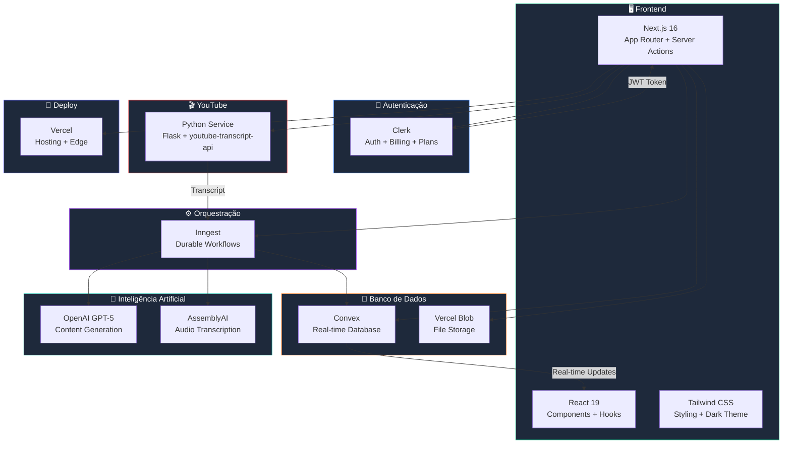
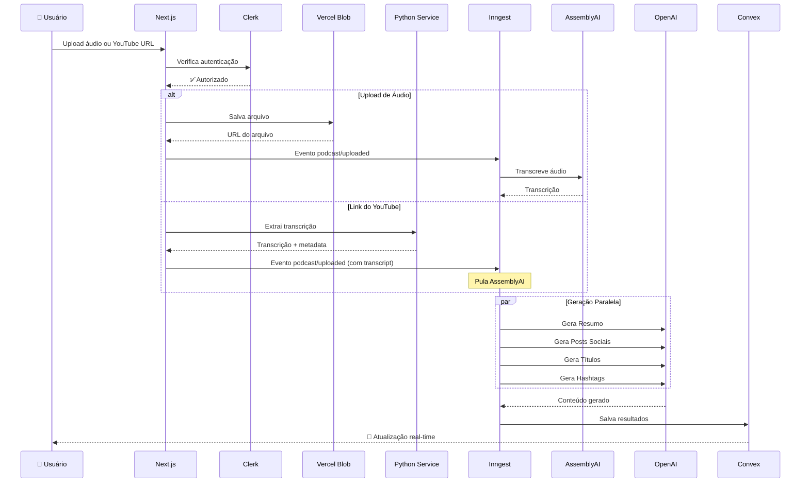
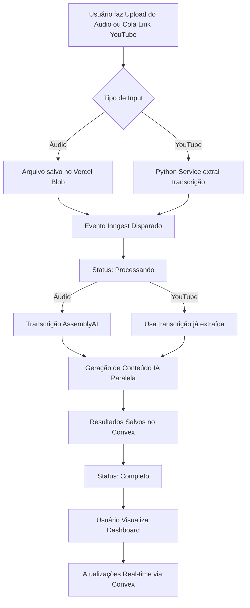
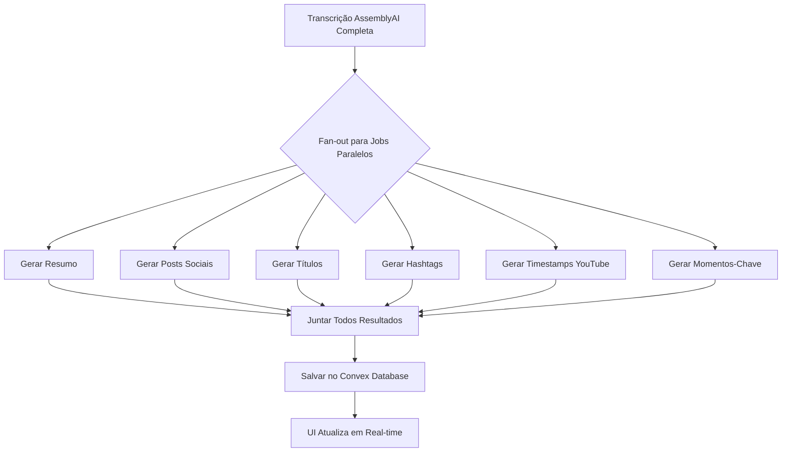
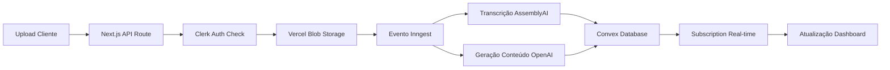

# AI Content Engine - Project 02 | AI CODE PRO

[](https://cienciadosdados.com)


> **🎯 Project 02** do programa **AI CODE PRO** da [Ciência dos Dados](https://cienciadosdados.com)

## Pare de Gastar Horas Extraindo Informações de Podcasts - Deixe a IA Fazer!

Faça upload do seu podcast **ou cole um link do YouTube**. Receba conteúdo otimizado para 6 redes sociais automaticamente.

---

### 📌 Para Quem É Este Projeto

**Criadores de podcast afogados em trabalho de pós-produção**

Você passou horas gravando, editando e produzindo seu podcast. Agora precisa:
- Escrever posts para 6 plataformas diferentes
- Criar títulos e descrições atraentes
- Gerar timestamps para YouTube
- Encontrar os melhores momentos para clips
- Escrever legendas e hashtags

**Este app faz tudo isso em segundos.**

### 🎯 Diferencial Principal

**Workflow completo de IA do upload ao conteúdo multi-plataforma**

Não é apenas transcrição. Não é apenas resumos. É um sistema completo de distribuição de conteúdo alimentado por IA que entende seu podcast e cria conteúdo personalizado para cada plataforma.

### ⚡ Destaque Técnico

**Processamento paralelo de IA com Inngest (5x mais rápido que sequencial)**

Em vez de esperar 5 minutos para tarefas de IA rodarem uma por uma, executamos 6 jobs de geração simultaneamente. Seu conteúdo fica pronto em ~90 segundos.

---

## 🤔 O Que É Este App?

Pense nele como **sua redação de IA para conteúdo de podcast**.

Explicação simples:

1. **Você faz upload** de um arquivo de áudio (seu episódio de podcast) **ou cola um link do YouTube**
2. **A IA analisa** seu conteúdo, entendendo speakers, tópicos e momentos-chave
3. **Você recebe** um pacote completo de distribuição:
   - Resumo com insights principais
   - Posts para Twitter, LinkedIn, Instagram, TikTok, YouTube e Facebook
   - Sugestões de títulos (curtos, longos, otimizados para SEO)
   - Hashtags específicas por plataforma
   - Timestamps de capítulos para YouTube
   - Momentos-chave para clips virais
   - Transcrição completa com identificação de speakers

**O workflow:** Gravar → Upload (ou YouTube) → IA Analisa → Receber Conteúdo

Sem escrita manual. Sem copiar e colar entre plataformas. Sem adivinhar quais hashtags funcionam.

---

## 🎓 Sobre o AI CODE PRO

Este projeto faz parte do programa **AI CODE PRO** da [Ciência dos Dados](https://cienciadosdados.com), onde construímos aplicações completas utilizando IA e as tecnologias mais modernas do mercado.

### 💡 O Que Você Aprende

- **Next.js 16** - Server actions, app router, API routes e streaming
- **Bancos Real-time** - Convex para atualizações instantâneas sem polling
- **Integrações de IA** - OpenAI, AssemblyAI e prompt engineering
- **Background Jobs** - Inngest para workflows duráveis e observáveis
- **Auth & Billing Modernos** - Clerk com gestão de assinaturas
- **Deploy em Produção** - Vercel, variáveis de ambiente e monitoramento

### 📅 Projetos do AI CODE PRO

- **Project 01**: Fundamentos e setup inicial
- **Project 02**: AI Content Engine (este projeto)
- **Project 03+**: Projetos avançados

### 👉 [Saiba mais em cienciadosdados.com](https://cienciadosdados.com)

---

## ✨ Features

### Para Criadores de Podcast

- **🎬 Suporte a YouTube** - Cole um link do YouTube e extraia transcrição automaticamente (sem precisar de áudio!)
- **📝 Resumo com IA** - Visão geral completa com bullets, insights principais e TL;DR
- **📱 Posts para Redes Sociais** - Conteúdo otimizado para 6 plataformas:
  - **Twitter** - 280 caracteres, direto e engajador
  - **LinkedIn** - Tom profissional, thought leadership
  - **Instagram** - Ganchos visuais com perguntas de engajamento
  - **TikTok** - Casual, trend-aware, Gen-Z friendly
  - **YouTube** - Descrição com CTAs e timestamps
  - **Facebook** - Focado em comunidade, iniciadores de conversa
- **🎯 Sugestões de Títulos** - 4 estilos diferentes para cada uso:
  - YouTube Curto (chamativo, menos de 60 chars)
  - YouTube Longo (descritivo, SEO-friendly)
  - Títulos de Podcast (focado no episódio)
  - Keywords SEO (descobribilidade)
- **#️⃣ Hashtags** - Tags específicas por plataforma otimizadas para alcance
- **⏱️ Timestamps YouTube** - Marcadores de capítulo gerados automaticamente
- **🎤 Momentos-Chave** - IA identifica oportunidades de clips virais com timestamps
- **👥 Diarização de Speakers** - "Quem disse o quê" com labels e scores de confiança

### Features Técnicas

- **⚡ Processamento Paralelo** - 6 jobs de IA rodam simultaneamente (60s total vs 300s sequencial)
- **🔄 Atualizações Real-time** - Veja progresso ao vivo com Convex subscriptions (sem polling)
- **🛡️ Workflows Duráveis** - Inngest faz retry automático de steps falhos (sem perda de trabalho)
- **📊 Feature Gating por Plano** - Features desbloqueiam baseado no tier (Free/Pro/Ultra)
- **🎨 Suporte Dark Mode** - UI bonita que adapta à sua preferência
- **📦 Type-safe End-to-End** - TypeScript completo com validação Zod
- **🔐 Seguro por Padrão** - Autenticação Clerk com segurança row-level

---

## 💰 Planos de Preços

| Feature | FREE | PRO ($29/mês) | ULTRA ($69/mês) |
|---------|:----:|:------------:|:--------------:|
| **Projetos** | 3 lifetime | 30/mês | Ilimitado |
| **Tamanho Arquivo** | 10 MB | 200 MB | 3 GB |
| **Duração Máxima** | 10 min | 2 horas | Ilimitado |
| **Resumo IA** | ✓ | ✓ | ✓ |
| **Posts Sociais** | ✗ | ✓ | ✓ |
| **Títulos & Hashtags** | ✗ | ✓ | ✓ |
| **Timestamps YouTube** | ✗ | ✗ | ✓ |
| **Momentos-Chave** | ✗ | ✗ | ✓ |
| **Transcrição Completa** | ✗ | ✗ | ✓ |
| **Diarização de Speakers** | ✗ | ✗ | ✓ |

---

## 🔧 Como Funciona

### Stack de Tecnologias



### Fluxo de Dados Entre Serviços



### Fluxo do Usuário



**Notas de Performance:**
- Transcrição (Áudio): ~30-60 segundos via AssemblyAI
- Transcrição (YouTube): ~2-5 segundos (extração direta)
- Geração de Conteúdo IA (paralela): ~60 segundos
- **Tempo Total de Processamento: ~90-120 segundos (áudio) ou ~60-70 segundos (YouTube)**

---

### Arquitetura de Processamento Paralelo



**Por Que Isso Importa:**
- **Sequencial**: 6 jobs × 50s cada = ~300 segundos (5 minutos)
- **Paralelo**: Todos jobs rodam simultaneamente = ~60 segundos
- **Resultado**: 5x mais rápido

---

### Arquitetura de Dados



---

## 🚀 Começando

### Pré-requisitos

Antes de começar, certifique-se de ter:

- **Node.js 18+** e **pnpm** instalados
- Contas criadas para todos os serviços (veja seção de Configuração abaixo)
- **Git** para controle de versão
- Um editor de código (VS Code recomendado)

### Passos de Instalação

1. **Clone o repositório**

```bash
git clone https://github.com/cienciadosdados/podcast.git
cd podcast
```

2. **Instale as dependências**

```bash
pnpm install
```

3. **Configure as variáveis de ambiente**

```bash
cp .env.example .env.local
```

Preencha todas as chaves necessárias no `.env.local` (veja seção Variáveis de Ambiente abaixo).

4. **Inicie os serviços de desenvolvimento** (3 terminais)

**Terminal 1 - Serviço Python (YouTube):**
```bash
cd python-service
python -m venv venv
venv\Scripts\activate  # Windows
# source venv/bin/activate  # Linux/Mac
pip install flask youtube-transcript-api requests flask-cors
python app.py
```

**Terminal 2 - Next.js + Convex:**
```bash
pnpm dev
```

**Terminal 3 - Inngest Dev Server:**
```bash
npx inngest-cli@latest dev
```

5. **Abra seu navegador**

Navegue para `http://localhost:3000`

**URLs dos serviços:**
- App: http://localhost:3000
- Python Service: http://localhost:5000
- Inngest Dashboard: http://localhost:8288

---

### Variáveis de Ambiente

Crie um arquivo `.env.local` na raiz do projeto com as seguintes variáveis:

```bash
# Convex
CONVEX_DEPLOYMENT=dev:ai-podcast-saas-inngest-coderabbit-clerk
NEXT_PUBLIC_CONVEX_URL=https://your-project.convex.cloud

# Clerk
NEXT_PUBLIC_CLERK_PUBLISHABLE_KEY=pk_test_...
CLERK_SECRET_KEY=sk_test_...
CLERK_JWT_ISSUER_DOMAIN=your-domain.clerk.accounts.dev

# Vercel Blob
BLOB_READ_WRITE_TOKEN=vercel_blob_...

# Assembly AI
ASSEMBLYAI_API_KEY=...

# OpenAI
OPENAI_API_KEY=sk-proj-...

# Inngest
INNGEST_EVENT_KEY=...
INNGEST_SIGNING_KEY=signkey-prod-...

# YouTube Service (opcional - para desenvolvimento local)
YOUTUBE_SERVICE_URL=http://localhost:5000
```

**Notas de Segurança:**

- ⚠️ **NUNCA faça commit do `.env.local`** no controle de versão
- ✅ Use `.env.example` como template (seguro para commit)
- 🔑 Variáveis com prefixo `NEXT_PUBLIC_` são expostas ao browser
- 🔒 Outras variáveis são apenas server-side

---

### Configuração dos Serviços

#### 1. Clerk (Autenticação & Billing)

1. Acesse [Clerk Dashboard](https://clerk.com)
2. Crie uma nova aplicação
3. Copie suas chaves publishable e secret para `.env.local`
4. **Habilite Billing**:
   - Vá em "Billing" → "Subscriptions"
   - Crie três planos: `free`, `pro`, `ultra`
   - Defina preços: Free ($0), Pro ($29/mês), Ultra ($69/mês)
5. **Configure Features** (use estes identificadores):
   - `summary` (Free, Pro, Ultra)
   - `social_posts` (Pro, Ultra)
   - `titles` (Pro, Ultra)
   - `hashtags` (Pro, Ultra)
   - `youtube_timestamps` (Ultra only)
   - `key_moments` (Ultra only)
   - `speaker_diarization` (Ultra only)

#### 2. Convex (Banco Real-time)

1. Acesse [Convex Dashboard](https://convex.dev)
2. Crie um novo projeto
3. Copie a URL de deployment para `.env.local`
4. O schema será auto-deployed quando rodar `pnpm convex dev`

#### 3. Vercel Blob (Storage de Arquivos)

1. Acesse [Vercel Dashboard](https://vercel.com)
2. Crie um novo projeto (ou use existente)
3. Vá em "Storage" → "Create Database" → "Blob"
4. Copie o `BLOB_READ_WRITE_TOKEN` para `.env.local`

#### 4. Inngest (Orquestração de Workflows)

1. Acesse [Inngest Dashboard](https://inngest.com)
2. Crie um novo app
3. Copie Event Key e Signing Key para `.env.local`
4. **IMPORTANTE**: Use o domínio de **Settings → Domains** do Vercel (não URLs de deployment)
5. Em desenvolvimento, Inngest auto-descobre suas funções

#### 5. AssemblyAI (Transcrição)

1. Acesse [AssemblyAI Dashboard](https://www.assemblyai.com/dashboard)
2. Crie uma conta (tier gratuito disponível)
3. Copie sua API key para `.env.local`
4. **Preço**: ~$0.00025/segundo (~$0.65 por hora de áudio)

#### 6. OpenAI (Geração de Conteúdo IA)

1. Acesse [OpenAI Platform](https://platform.openai.com)
2. Crie uma API key
3. Adicione créditos à sua conta (pay-as-you-go)
4. Copie sua API key para `.env.local`
5. **Modelo Usado**: GPT-5-mini (~$0.05 por episódio de podcast)

#### 7. Python Service (YouTube - Desenvolvimento Local)

O serviço Python é necessário apenas para desenvolvimento local da feature de YouTube.

1. Instale Python 3.8+
2. Navegue para `python-service/`
3. Crie um ambiente virtual e instale dependências:
```bash
python -m venv venv
venv\Scripts\activate  # Windows
pip install flask youtube-transcript-api requests flask-cors
```
4. Execute: `python app.py`
5. O serviço estará disponível em `http://localhost:5000`

**Nota**: Para produção, o serviço Python precisa ser hospedado separadamente (Railway, Render, etc.)

---

### Checklist Primeira Configuração

Antes de fazer upload do primeiro podcast, verifique:

- [ ] Todas variáveis de ambiente configuradas no `.env.local`
- [ ] Serviço Python rodando (`python app.py` na pasta `python-service/`)
- [ ] Next.js + Convex rodando (`pnpm dev`)
- [ ] Inngest Dev Server rodando (`npx inngest-cli@latest dev`)
- [ ] Aplicação Clerk configurada com planos de billing
- [ ] Você consegue acessar o app em `http://localhost:3000`
- [ ] Teste upload com arquivo pequeno (menos de 10MB) ou link do YouTube

---

## 📊 Visão Geral do Schema

### Modelo Principal: Tabela `projects`

Toda a aplicação gira em torno de uma única tabela `projects` no Convex. Esta estrutura denormalizada permite atualizações atômicas e reatividade em tempo real.

**Campos Principais:**

| Campo | Tipo | Descrição |
|-------|------|-----------|
| `userId` | string | Clerk user ID (vincula projeto ao usuário) |
| `inputUrl` | string | URL Vercel Blob do arquivo uploaded |
| `status` | enum | `uploaded` → `processing` → `completed` ou `failed` |
| `jobStatus` | object | Status granular para `transcription` e `contentGeneration` |
| `transcript` | object | Transcrição completa com segmentos, speakers, capítulos |
| `summary` | object | Resumo gerado por IA com bullets, insights, TLDR |
| `socialPosts` | object | Posts específicos por plataforma (Twitter, LinkedIn, etc.) |
| `titles` | object | Sugestões de títulos (YouTube, podcast, SEO) |
| `hashtags` | object | Recomendações de hashtags por plataforma |
| `youtubeTimestamps` | array | Marcadores de capítulo para descrições YouTube |
| `keyMoments` | array | Oportunidades de clips virais com timestamps |

**Decisões de Design:**

- **Estrutura denormalizada** - Todos dados em um documento para atualizações atômicas
- **Campos opcionais** - Permitem população progressiva conforme jobs Inngest completam
- **Indexes** - Otimizam queries por usuário, status e data de criação
- **Reatividade real-time** - Subscriptions Convex disparam atualizações de UI automaticamente

**Indexes:**

- `by_user` - Lista todos projetos de um usuário
- `by_status` - Filtra por status de processamento
- `by_user_and_status` - Projetos ativos/completos do usuário
- `by_created_at` - Ordena por mais recente

---

## 🚀 Deploy

### Deploy na Vercel (Recomendado)

1. **Push seu código para GitHub**

```bash
git add .
git commit -m "Initial commit"
git push origin main
```

2. **Importe para Vercel**

- Acesse [Vercel Dashboard](https://vercel.com)
- Clique "Import Project"
- Selecione seu repositório GitHub
- Vercel auto-detecta Next.js

3. **Adicione variáveis de ambiente**

No dashboard Vercel → Settings → Environment Variables, adicione todas variáveis do seu `.env.local`

4. **Deploy**

Vercel faz deploy automaticamente a cada push para `main`

5. **Configure domínio customizado** (opcional)

Settings → Domains → Adicione seu domínio

---

### Deploy via CLI

```bash
npx vercel --prod
```

Siga os prompts para fazer deploy.

---

### Checklist Pós-Deploy

Após fazer deploy em produção:

- [ ] Todas variáveis de ambiente configuradas no dashboard Vercel
- [ ] Ambiente de produção do Inngest configurado (separado do dev)
- [ ] Instância de produção do Clerk conectada
- [ ] Atualizar `NEXT_PUBLIC_APP_URL` para sua URL de produção
- [ ] Testar upload em produção com arquivo pequeno
- [ ] Monitorar dashboard Inngest para erros de workflow
- [ ] Verificar logs Vercel para erros de runtime

---

### Monitoramento & Observabilidade

Fique de olho nestes dashboards:

- **Inngest Dashboard** - Logs de execução, tentativas de retry, falhas
- **Convex Dashboard** - Queries de banco, métricas de performance, conexões real-time
- **Vercel Analytics** - Tráfego, page views, performance de edge functions
- **Clerk Dashboard** - Signups de usuários, assinaturas ativas, eventos de billing

---

## 🐛 Problemas Comuns & Soluções

### Problemas de Desenvolvimento

#### Erro: Convex não conecta

**Problema:** Não consegue conectar ao banco Convex

**Solução:**
```bash
# Certifique-se que o Convex dev server está rodando em terminal separado
pnpm convex dev
```

#### Erro: Upload de arquivo falha

**Problema:** Upload retorna erro 400 ou 500

**Solução:**
- Verifique se Vercel Blob está habilitado nas configurações do projeto
- Confirme que `BLOB_READ_WRITE_TOKEN` está correto
- Verifique console do browser para erros de CORS

#### Erro: Inngest não dispara

**Problema:** Arquivo faz upload mas processamento nunca inicia

**Solução:**
- Verifique `INNGEST_EVENT_KEY` e `INNGEST_SIGNING_KEY` no `.env.local`
- Confirme que Inngest dev server está conectado (veja logs no terminal)
- Certifique-se que rota `/api/inngest` está acessível
- **IMPORTANTE**: Use o domínio de **Settings → Domains** do Vercel (não URLs de deployment)

---

### Problemas de Banco de Dados

#### Projetos não aparecem

**Problema:** Usuário faz upload mas não vê no dashboard

**Solução:**
- Verifique se Clerk `userId` corresponde ao `userId` do projeto no banco
- Confirme que Convex provider envolve seu app em `app/layout.tsx`
- Verifique console do browser para erros de conexão Convex

#### Atualizações real-time não funcionam

**Problema:** Dashboard não atualiza automaticamente durante processamento

**Solução:**
- Certifique-se que `ConvexProvider` envolve seu app
- Confirme que está usando `useQuery` (não `fetchQuery`) para dados reativos
- Verifique dashboard Convex para problemas de conexão

---

### Problemas de Autenticação

#### Loops de redirect Clerk

**Problema:** Preso em redirect infinito após sign in

**Solução:**
- Verifique se `NEXT_PUBLIC_CLERK_PUBLISHABLE_KEY` está correto
- Confira URLs de redirect corretas no dashboard Clerk
- Limpe cookies do browser e tente novamente

#### Billing não funciona

**Problema:** Usuários não conseguem fazer upgrade ou limites não são aplicados

**Solução:**
- Configure planos no dashboard Clerk com identificadores corretos: `free`, `pro`, `ultra`
- Certifique-se que identificadores de features correspondem ao `tier-config.ts`
- Verifique configuração de webhook Clerk para eventos de subscription

---

### Problemas de Processamento

#### Geração IA travada

**Problema:** Projeto travado em status "processing"

**Solução:**
- Verifique dashboard Inngest para logs de erro
- Confirme que `OPENAI_API_KEY` é válida e tem créditos
- Verifique página de status da API OpenAI para outages

#### Transcrição falha

**Problema:** Step de transcrição falha imediatamente

**Solução:**
- Verifique se `ASSEMBLYAI_API_KEY` é válida
- Confirme que formato do arquivo é suportado (MP3, MP4, WAV, etc.)
- Certifique-se que URL do arquivo é publicamente acessível
- Verifique dashboard AssemblyAI para limites de quota

#### Features de plano não aplicam

**Problema:** Usuários free veem features Pro/Ultra

**Solução:**
- Verifique se configuração de planos Clerk corresponde ao `tier-config.ts`
- Confira lógica de detecção de plano em `lib/tier-utils.ts`
- Certifique-se que função `has` é chamada corretamente nas API routes

---

## 🏆 Próximos Passos - Desafios!

Quer evoluir este projeto? Aqui estão algumas features avançadas que você pode construir:

### Features Avançadas

- **📄 Exportar para PDF/Google Doc** - Gerar relatórios PDF bonitos com todo conteúdo
- **📅 Agendamento de Redes Sociais** - Integração com Buffer ou Hootsuite para auto-posting
- **🌍 Suporte Multi-idioma** - Transcrever e traduzir para 10+ idiomas
- **🎨 Presets de Tom de IA** - Permitir usuários definir voz da marca para geração IA
- **📦 Processamento em Lote** - Upload de 10 episódios, processar todos durante a noite
- **🎥 Geração de Video Clips** - Criar automaticamente video clips dos momentos-chave
- **📊 Dashboard de Analytics** - Rastrear qual conteúdo performa melhor em cada plataforma

### Melhorias de IA

- **🧠 Fine-tuning** - Treinar GPT no estilo específico do podcast do usuário
- **💬 Prompts Customizados** - Permitir usuários escreverem seus próprios templates por plataforma
- **😊 Análise de Sentimento** - Tagar automaticamente momentos como engraçados, insightful, controversos
- **A/B Testing** - Gerar múltiplas variações de título e rastrear qual performa melhor
- **🔍 Recomendações de Conteúdo** - "Baseado neste episódio, você deveria falar sobre..."

### Infraestrutura & Escala

- **☁️ Cloudflare R2** - Migrar do Vercel Blob para storage mais barato a longo prazo
- **⚡ Redis Caching** - Cache de projetos e transcrições frequentemente acessados
- **🪝 Notificações Webhook** - Alertar usuários via email/SMS quando processamento completa
- **🔧 Worker Service Separado** - Mover processamento pesado para infraestrutura dedicada
- **📊 Analytics de Uso** - Rastrear custos por usuário para otimização de pricing

### Features de Monetização

- **👥 Planos de Time** - Acesso multi-usuário com permissões baseadas em roles
- **🏷️ Opção White-label** - Permitir agências rebrandar o app para seus clientes
- **🔌 Acesso API** - Tier enterprise com REST API para automação
- **💳 Sistema de Créditos** - Modelo pay-per-use ao invés de assinaturas
- **🎁 Programa de Referral** - Recompensar usuários por trazer novos clientes

**Escolha uma feature e construa!** Depois compartilhe no programa AI CODE PRO da Ciência dos Dados.

---

## 📄 Licença

Este projeto é licenciado sob a **Creative Commons Attribution-NonCommercial 4.0 International License (CC BY-NC 4.0)**.

### Você PODE:

- ✅ Usar este código para **aprendizado pessoal** e educação
- ✅ Modificar e adaptar o código para seus próprios projetos
- ✅ Compartilhar o código com outros (com atribuição)
- ✅ Usar em seu **portfólio** (showcase não-comercial)
- ✅ Fork, clone e experimentar com o codebase

### Você NÃO PODE:

- ❌ Usar este código para **propósitos comerciais** (venda, SaaS, trabalho para clientes)
- ❌ Vender esta aplicação ou derivados dela
- ❌ Remover atribuição ao autor original
- ❌ Relicenciar o código sob termos diferentes

### Para Licenciamento Comercial

Interessado em usar este projeto comercialmente? Entre em contato:

- **Licença Startup** - Para empresas em estágio inicial
- **Licença Enterprise** - Para empresas estabelecidas
- **Licença White-label** - Direitos completos de customização para agências

**Contato:** Abra uma issue no GitHub ou entre em contato via [cienciadosdados.com](https://cienciadosdados.com)

Texto completo da licença: [LICENSE.md](./LICENSE.md)

---

## 📚 Referência Rápida

### Comandos Úteis

```bash
# Desenvolvimento
pnpm dev          # Inicia Next.js dev server + Convex watch
pnpm build        # Build para produção
pnpm start        # Inicia servidor de produção
pnpm lint         # Roda Biome linter
pnpm format       # Formata código com Biome

# Convex
pnpm convex dev   # Inicia banco Convex de desenvolvimento
pnpm convex deploy # Deploy Convex para produção

# Deployment
npx vercel        # Deploy para Vercel (preview)
npx vercel --prod # Deploy para produção
```

---

### Conceitos Importantes

**Feature Gating por Plano**

Features são habilitadas baseado no tier de assinatura Clerk do usuário:
- **Free**: Apenas Summary (3 projetos lifetime)
- **Pro**: + Social posts, titles, hashtags (30 projetos/mês)
- **Ultra**: + YouTube timestamps, key moments, full transcript (ilimitado)

**Processamento Paralelo de IA**

Em vez de rodar tarefas de geração IA sequencialmente (lento), Inngest roda 6 jobs em paralelo usando `Promise.allSettled`. Isso reduz tempo de processamento de ~5 minutos para ~60 segundos.

**Atualizações Real-time**

Subscriptions Convex (`useQuery`) re-renderizam componentes automaticamente quando dados do banco mudam. Sem polling, sem refetch manual. Conforme Inngest atualiza status do projeto, UI atualiza instantaneamente.

**Execução Durável**

Inngest provê lógica de retry automático. Se OpenAI der timeout ou AssemblyAI falhar, o step faz retry com backoff exponencial. Seus usuários nunca perdem trabalho.

---

## 🙏 Agradecimentos

Construído com ferramentas incríveis de:
- [Clerk](https://clerk.com) - Autenticação & Billing
- [Inngest](https://inngest.com) - Orquestração de Workflows
- [Convex](https://convex.dev) - Banco Real-time
- [Vercel](https://vercel.com) - Deploy & Storage
- [AssemblyAI](https://www.assemblyai.com) - Inteligência de Áudio
- [OpenAI](https://platform.openai.com) - Geração de Conteúdo IA

---

## 💬 Dúvidas ou Problemas?

- **Encontrou um bug?** Abra uma issue no GitHub
- **Precisa de ajuda?** Entre em contato via [cienciadosdados.com](https://cienciadosdados.com)
- **Quer contribuir?** PRs são bem-vindos (veja LICENSE para termos)

---

**Construído com ❤️ para a comunidade Ciência dos Dados - AI CODE PRO Project 02**
